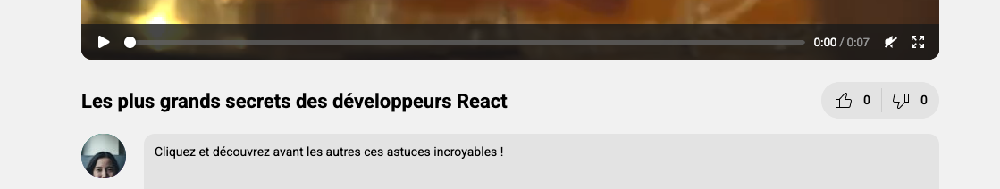

# A. Préparatifs <!-- omit in toc -->

## Sommaire <!-- omit in toc -->
- [A.1. Récupération du projet](#a1-récupération-du-projet)
- [A.2. Lancement de l'API REST](#a2-lancement-de-lapi-rest)


## A.1. Récupération du projet
Vous commencez maintenant à avoir l'habitude, je ne rentrerai donc pas dans les détails mais voici les différentes étapes pour le lancement du projet en mode [TL;DR](https://en.wiktionary.org/wiki/tl;dr)

1. **Commencez par fork le TP sur https://gitlab.univ-lille.fr/react/tp5/-/forks/new**

	- **placé dans VOTRE profil utilisateur** (`namespace`)
	- **en mode "private"** (`Visibility Level`)
	- ⚠️ **ajoutez votre encadrant de TP (`@gery.casiez` ou `@thomas.fritsch`) en `"reporter"`** ⚠️

2. **Tapez dans un terminal :**
	```bash
	mkdir ~/tps-react
	git clone https://gitlab.univ-lille.fr/<votre-username>/tp5.git ~/tps-react/tp5
	codium ~/tps-react/tp5
	```
3. **Puis dans un terminal intégré de VSCodium** (<kbb>CTRL/Cmd</kbd>+<kbd>J</kbd>) :
	```bash
	npm i
	npm start
	```
	> _**NB :** si vous souhaitez plus de précisions sur les commandes précédentes et l'installation  / configuration du projet, vous pouvez vous référer au chapitre [A. Préparatifs](https://gitlab.univ-lille.fr/react/tp2/-/blob/cours-iut/A-preparatifs.md) du TP2 ou simplement demander de l'aide au formateur_ 😄

4. **Lancez votre site en mode "debug dans vscode"** : tapez <kbd>CTRL</kbd>+<kbd>SHIFT</kbd>+<kbd>P</kbd> puis sélectionnez `"Debug: Select and start debugging"` ou appuyez simplement sur la touche <kbd>F5</kbd>.

	Le résultat attendu est le suivant :

	

5. **Avant de vous lancer dans ce TP, prenez 5 à 10 minutes pour lire le code contenu dans le dossier `/src`** et comparez-le avec votre code du précédent TP.

	**C'est important de bien comprendre le code qui vous est fourni car il servira de base aux exercices de ce TP** : si des points ne sont pas clairs, interrogez votre encadrant.e de TP !

	**Attention : si vous n'aviez pas eu le temps de terminer le précédent TP**, portez une attention toute particulière aux fichiers :
	- `Navigator.jsx`
	- `VideoDetail.jsx` et `CommentList.jsx`
	- `VideoList.jsx` et `VideoThumbnail.jsx`


## A.2. Lancement de l'API REST
_**Dans ce TP on va enfin connecter notre appli web à une base de données grâce à une API REST qui vous est fournie ici : https://gitlab.univ-lille.fr/react/api-server**_

Ce serveur (_basé sur [Express.js](http://expressjs.com/)_) fournit une API REST minimaliste mais qui va être suffisante pour connecter notre appli React à une base de données [SQLite](https://sqlite.org/index.html) (_générée à la volée_).

1. **Commencez par cloner le serveur :**
	```bash
	git clone https://gitlab.univ-lille.fr/react/api-server.git ~/tps-react/api-server
	```
2. **Installez ensuite les dépendances du serveur :**
	```bash
	cd ~/tps-react/api-server
	npm i
	```

	> _**NB :** Si cette commande déclenche une erreur en rapport avec node-gyp et que vous êtes sur Windows, c'est peut-être que vous avez oublié de cocher la case **"Automatically install the necessary tools. ..."** sur l'écran "Tools for native modules" lors de l'installation de Node.js (comme indiqué dans le premier TP). Si c'est le cas il vous faudra **désinstaller et réinstaller Node en prenant soin de cocher cette case**._
	>
	> _Si malgré ça l'erreur persiste, alors vous pouvez tenter d'installer les `windows-build-tools` en ouvrant un terminal **en mode ⚠ ADMINISTRATEUR ⚠ (IMPORTANT)** et en lançant la commande :_
	> ```bash
	> npm install --global --production --verbose windows-build-tools
	> ```
	>
	> _Patientez 5 ~ 10 minutes que tout s'installe, fermez vos terminaux ouverts (pour mettre à jour le PATH), relancez un terminal, puis retentez d'installer le serveur._
	>
	> _Si jamais l'installation de `windows-build-tools` bloque sur la ligne **"Successfully installed Python 2.7"** pendant plus de 5 ~ 10 minutes, vous pouvez tenter la manipulation décrite sur cette issue github pour débloquer l'install : https://github.com/felixrieseberg/windows-build-tools/issues/172#issuecomment-484091133_

3. **Lancez le serveur à l'aide de la commande :**
	```bash
	npm start
	```

	

	> _**NB :** attention de bien lancer cette commande dans le dossier `api-server`_

4. **Vérifiez que la base de données SQLite a bien été créée** en vérifiant qu'un fichier `db.sqlite` figure bien maintenant dans le dossier `~/tps-react/api-server/`.

5. **Enfin, assurez-vous du bon fonctionnement de l'API REST en ouvrant l'URL http://localhost:8080/api/videos dans votre navigateur.** Si tout se passe bien vous devez voir un JSON s'afficher avec des vidéos dedans !

	


## Étape suivante <!-- omit in toc -->
Si tout fonctionne, vous pouvez passer à l'étape suivante : [B. AJAX](B-ajax.md)