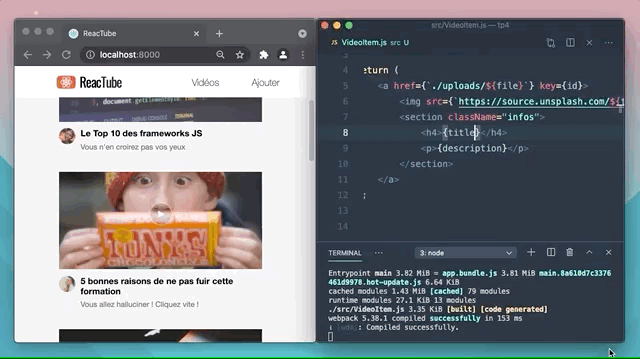

# A. Préparatifs <!-- omit in toc -->

## Sommaire <!-- omit in toc -->
- [A.1. Récupération du projet](#a1-récupération-du-projet)
- [A.2. Configuration de Prettier](#a2-configuration-de-prettier)
- [A.3. Outils de dev](#a3-outils-de-dev)
- [A.4. Installation de React](#a4-installation-de-react)
- [A.5. Lancement de l'application](#a5-lancement-de-lapplication)

## A.1. Récupération du projet
**Ce repo contient une solution commentée du précédent TP.** <br>
Pour ce TP vous pouvez soit repartir de vos fichiers du précédent TP (si vous l'aviez terminé et que le formateur a validé que tout était correct) ou bien cloner ce repo et vous en servir comme base pour ce TP.

*Si vous repartez de vos fichiers, **pensez à faire un `git pull`** pour récupérer les dernières modifications du repo (probablement des modifs de CSS ou des corrections de dernière minute).*

1. **Récupérez les fichiers de ce TP grâce à Git : clonez ce repo dans un dossier de votre choix** (_dans mon exemple /home/thomas/tps-react/tp2_):
	```bash
	mkdir ~/tps-react
	git clone https://framagit.org/formation/react/tp2.git ~/tps-react/tp2
	```
	> _**NB1 :** Comme pour le TP1, je clone ici dans mon dossier `/home/thomas/tps-react/tp2`. **Si vous êtes sous Windows faites attention au sens des slashs et au caractère `"~"`** qui représente le dossier de l'utilisateur sur système unix : utilisez **Git bash** (qui comprend cette syntaxe) ou si vous tenez vraiment à utiliser **cmd** ou **powershell** pensez à adapter la commande !_

	> _**NB2 :** Comme pour le TP1 aussi, si vous préférez **cloner en SSH** pour ne pas avoir à taper votre mot de passe à chaque fois que vous clonerez un TP, renseignez votre clé SSH dans votre [compte utilisateur framagit](https://framagit.org/-/profile/keys) et clonez à partir de cette URL : `git@framagit.org:formation/react/tp2.git`_

2. **Ouvrez le projet dans VSCodium** (pour les différentes façon d'ouvrir le projet relisez les [instructions du TP0](https://framagit.org/formation/react/tp0/-/blob/master/A-preparatifs.md#a4-ouvrir-le-projet-dans-vscodium) )
	```bash
	codium ~/tps-react/tp2
	```
	> _**NB :** Si vous utilisez VSCode, la commande `codium` doit être remplacée par `code`_

3. **Installez les paquets npm nécessaires au projet** notamment [Vite](https://vitejs.dev).<br>
	Ouvrez un terminal intégré à VSCodium (<kbd>CTRL</kbd>+<kbd>J</kbd> *(PC)* / <kbd>CMD</kbd>+<kbd>J</kbd> *(Mac)*) et tapez juste :
	```bash
	npm install
	```

	> _**NB :** Vous noterez qu'on ne précise pas les paquets à installer. npm va en effet les déterminer **automatiquement** à partir du contenu du fichier `package.json` et plus particulièrement à partir des sections `"dependencies"` et `"devDependencies"` qui indiquent quels sont les paquets qui ont été installés précédemment._
	>
	> **Magique !** 🙌


## A.2. Configuration de Prettier


_**Lors des précédents TP, vous avez en principe installé l'extension Prettier dans VSCodium.**_

Prettier est un formateur de code automatique qui est le plus populaire à l'heure actuelle dans l'écosystème JavaScript.

**C'est le moment de configurer cette extension** pour l'utiliser dans notre projet.

1. **Remplacez le contenu du fichier `.vscode/settings.json` par les lignes suivantes** :

	```json
	{
		"[javascript]": {
			"editor.formatOnSave": true,
			"editor.defaultFormatter": "esbenp.prettier-vscode"
		},
		"[javascriptreact]": {
			"editor.formatOnSave": true,
			"editor.defaultFormatter": "esbenp.prettier-vscode"
		}
	}
	```
	> _**NB :** on n'a plus besoin de la clé `"javascript.preferences.importModuleSpecifierEnding"` puisque Vite supporte les import sans l'extension js à la fin, ce qui est ce que fait vscode par défaut._

2. **Créez ensuite un fichier `.prettierrc`** à la racine du TP :
	```json
	{
		"singleQuote": true,
		"trailingComma": "es5",
		"useTabs": true,
		"bracketSameLine": false,
		"arrowParens": "avoid"
	}
	```
3. **Enfin, installez le paquet npm `prettier`** dans le projet (_nécessaire pour que l'extension vscodium fonctionne_) :
	```bash
	npm install --save-dev prettier
	```
	Avec cette configuration, vos fichiers JS seront maintenant automatiquement formatés à chaque sauvegarde ! Plus besoin de vous tracasser avec les retours à la ligne, les tabulations, les espaces, tout sera géré automatiquement par Prettier !

	> _**NB :** si vous souhaitez en savoir plus sur la liste des configurations possibles, rendez-vous sur https://prettier.io/docs/en/configuration.html_


## A.3. Outils de dev

Installez l'extension **React Developer Tools** :
- sur Chrome : https://chrome.google.com/webstore/detail/react-developer-tools/fmkadmapgofadopljbjfkapdkoienihi
- ou sur Firefox : https://addons.mozilla.org/en-US/firefox/addon/react-devtools/


## A.4. Installation de React


**Comme vu en cours React est une _bibliothèque_ JS.**

Pour l'utiliser dans notre appli on va d'abord devoir récupérer le code de cette bibliothèque. Et pour récupérer une bibliothèque quand on fait du JS de manière sérieuse, c'est **`npm`** qu'on utilise ! \
Comme nous sommes des gens sérieux, allons-y :

1. **Installez la bibliothèque [`react`](https://www.npmjs.com/package/react) avec npm :** Dans le dossier du TP (`à la racine, là où se trouve le package.json`), lancez la commande
	```bash
	npm i react
	```
	> _**NB :** `npm i ...` est un raccourci pour `npm install ...`_

	> _**NB2 :** vous avez peut-être remarqué que contrairement aux autres packages que l'on avait installés jusque là (`vite` et `prettier`), **`react` a été ajouté dans la section `"dependencies"` et pas `"devDependencies"`** du `package.json`._
	>
	> _En effet, tous les paquets que l'on a installés précédemment ne sont utilisés que pendant la **phase de développement** (pour la compilation ou le formatage de code source) mais ne contiennent rien qui soit vraiment utilisé dans "notre" code. C'est la raison pour laquelle on avait installé tous ces paquets avec **l'option `--save-dev`** (par exemple dans le TP1, on avait fait : `npm install --save-dev vite`, vous vous souvenez ?_ 🤔 _) ce qui avait pour conséquence d'ajouter ces paquets dans les **`"devDependencies"`**._
	>
	> _**Pour React, on n'a pas utilisé l'option `--save-dev` car on va utiliser React dans notre code, de fait il est installé dans la section `"dependencies"`.**_
	>
	> _Documentation officielle :_
	> - _dependencies : https://docs.npmjs.com/cli/v9/configuring-npm/package-json#dependencies_
	> - _devDependencies : https://docs.npmjs.com/cli/v9/configuring-npm/package-json#devdependencies_

2. **Comme vous le savez, React permet de développer des applis web mais aussi des apps mobiles** (_avec [React Native](https://reactnative.dev/)_).

	Dans notre cas il faut donc, en plus de [`react`](https://www.npmjs.com/package/react), **installer la lib [`react-dom`](https://www.npmjs.com/package/react-dom)** qui contient le code spécifique aux applis web :
	```bash
	npm i react-dom
	```
3. Puisque l'on souhaite utiliser du JSX, il faut **permettre à Vite de compiler le JSX en JS à l'aide du plugin [@vitejs/plugin-react](https://www.npmjs.com/package/@vitejs/plugin-react)** :
	```bash
	npm i -D @vitejs/plugin-react
	```
	> _**NB :** `-D` est un raccourci pour l'option `--save-dev`_

	En plus du support de JSX, `@vitejs/plugin-react` offre le support automatique du **Fast Refresh**.

	Jusqu'ici dans le TP vous bénéficiez grâce à Vite d'une technique qui s'appelle le "live reload" : c'est ce qui permet de recharger automatiquement le navigateur dès qu'un fichier html, js, ou css est modifié. Mais dans l'écosystème React, il existe encore mieux : le **Fast Refresh**.

	Le principe du Fast refresh, c'est que quand un composant de votre application est modifié, SEUL ce composant va être rechargé, sans avoir besoin de rafraîchir toute la page. Quels avantages ? Il y en a plein :
	- **on ne recharge pas toute la page**, donc pas le html, ni les CSS, ni les images ça va donc **beaucoup plus vite**
	- l'application **reste dans son état actuel** : notre navigateur reste là où il était dans la page (conservation du scroll, de la navigation, etc.)

	

	Génial non ? Et tout ça sans avoir rien d'autre à faire que d'intégrer `@vitejs/plugin-react` ! 😎

4. **Pour indiquer à Vite que l'on souhaite donc utiliser ce plugin dans notre code, on va ajouter un fichier de config `vite.config.mjs`** à la racine de notre TP, avec le contenu suivant :
	```js
	import react from '@vitejs/plugin-react';

	/** @type {import('vite').UserConfig} */
	export default {
		plugins: [react()],
	}
	```
5. **Supprimez tous les fichiers `.js` du dossier `src`, à l'exception du fichier `src/data.js` puis créez un fichier `src/app.jsx`** qui servira de point d'entrée à notre application React.

	Placez-y pour le moment juste un `console.log` :
	```js
	console.log('REACTube en React !');
	```

	> _**NB :** on utilise ici l'extension de fichier `.jsx` car c'est l'extension supportée par défaut par Vite._ \
	> _Personnellement je ne suis pas favorable à l'utilisation de cette extension, qui était celle employée lors des toutes premières alpha de React, mais qui avait été depuis délaissée pour revenir à l'extension `.js` (plus logique car on peut tout à faire faire des composants React qui n'utilisent pas de JSX, qui retournent par exemple juste une chaîne de caractères...)._
	>
	> _Malheureusement le plugin `@vitejs/plugin-react` [bride l'emploi du Fast Refresh si l'on utilise `.js`](https://github.com/vitejs/vite-plugin-react/issues/155) et n'offre pour le moment aucune possibilité de configuration._
	>
	> _En attendant que le plugin évolue, on est donc contraints à utiliser cette extension `.jsx` pour tous nos fichiers contenant du JSX si l'on veut avoir un refresh rapide des composants..._

6. **Enfin, modifiez le fichier `index.html`** pour lui indiquer que c'est ce fichier `src/app.jsx` qui est désormais le point d'entrée.

## A.5. Lancement de l'application

Comme dans le précédent TP, **lancez le serveur de développement de Vite** dans un terminal intégré de VSCodium (<kbd>CTRL</kbd>+<kbd>J</kbd> *(PC)* / <kbd>CMD</kbd>+<kbd>J</kbd> *(Mac)*) :

```bash
npm start
```

**Vérifiez ensuite dans le navigateur que la page index.html s'affiche correctement** en ouvrant l'url http://localhost:8000.

Le résultat attendu est le suivant :


**Dans la console, vérifiez que le message *`"REACTube en React !"`* s'affiche bien.**


> _**NB : Si la page ne s'affiche pas correctement**, vérifiez dans la `Console` ou dans l'onglet `Sources` (Chrome) ou `Debugger` (Firefox) qu'l n'y a pas d'erreur JS lorsque la page se charge._

## Étape suivante <!-- omit in toc -->
Si tout fonctionne, vous pouvez passer à l'étape suivante : [B. Un premier composant](B-premier-composant.md)