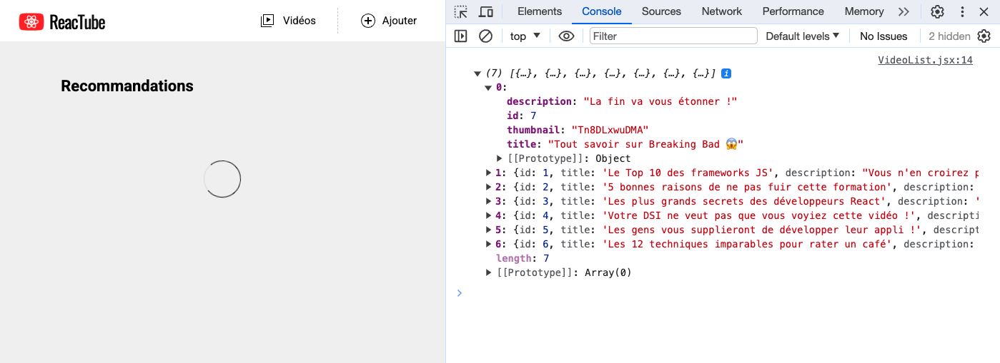

# B. AJAX <!-- omit in toc -->

_**Pour commencer ce TP nous allons connecter notre application React à l'API REST que l'on vient de lancer**_

## Sommaire <!-- omit in toc -->
- [B.1. Rappels : fetch](#b1-rappels--fetch)
- [B.2. Chargement de la liste des vidéos](#b2-chargement-de-la-liste-des-vidéos)

## B.1. Rappels : fetch
Comme vu en cours (_récupérez si ce n'est pas déjà fait le pdf !_) c'est l'[API fetch](https://developer.mozilla.org/en-US/docs/Web/API/Fetch_API/Using_Fetch) que l'on utilise en JS pour déclencher des appels AJAX.

> <details><summary>📖 <em>C'est quoi un appel AJAX ?</em> 😬</summary>
>
> _Un appel AJAX c'est une requête HTTP lancée par notre code JS mais en "sous-marin", sans rechargement de page._
>
> _C'est ce qu'on utilise pour interroger des webservices, envoyer ou récupérer des données d'une base de données, charger des fichiers, etc._
>
> _Dans le passé, on utilisait une classe [`XMLHttpRequest`](https://developer.mozilla.org/en-US/docs/Web/API/XMLHttpRequest) mais la syntaxe était lourde et pas facile à maintenir. Aujourd'hui, `fetch` étant supporté par la [quasi totalité des navigateurs](https://caniuse.com/fetch) on peut sans soucis oublier l'ancienne syntaxe._
> </details> des requêtes HTTP en "sous-marin", sans rechargement de page.

la fonction `fetch` utilise une syntaxe avec laquelle il facile de chaîner les traitements : les [Promises _(mdn)_](https://developer.mozilla.org/fr/docs/Web/JavaScript/Guide/Utiliser_les_promesses). Voyons ça tout de suite.


## B.2. Chargement de la liste des vidéos
1. **Commencez par supprimer l'import du module `data.ts` dans la `VideoList`.** Comme on va charger les données de la bdd, on n'a plus besoin de cet import (_ne supprimez cependant pas tout de suite le fichier, le `VideoDetail` l'utilise encore... pour l'instant !_)
2. **Supprimez ensuite le `setTimeout(...)` contenu dans le `useEffect` de la `VideoList`.**
3.  **A la place, lancez le chargement de la liste des vidéos avec l'API fetch** :
	```ts
	fetch('http://localhost:8080/api/videos');
	```

	Rechargez la page html dans le navigateur et vérifiez dans l'onglet Network/Réseau des devtools que votre page lance bien une requête HTTP vers http://localhost:8080/api/videos :

	

	Maintenant que l'on arrive à lancer la requête, reste à exploiter la réponse renvoyée par le serveur et à utiliser les données qu'elle contient !

4. **Commencez par inspecter la réponse retournée par `fetch()` grâce à la méthode `.then()`** :
	```ts
	fetch('http://localhost:8080/api/videos')
		.then( response => console.log(response) );
	```

	> <details><summary>📖 <em>Besoin d'explications sur le fonctionnement de ce <code>.then</code> ?</em></summary>
	>
	> _Ce qu'il faut comprendre c'est que la fonction `fetch()` retourne un objet qui est du type [`Promise` (mdn)](https://developer.mozilla.org/fr/docs/Web/JavaScript/Reference/Global_Objects/Promise). C'est sur cet objet qu'on appelle la méthode `.then()`. On pourrait d'ailleurs écrire le code ci-dessus comme ceci :_
	> ```ts
	> const myPromise = fetch('http://localhost:8080/api/videos');
	> myPromise.then( response => console.log(response) );
	> ```
	> _Cet objet de type `Promise` dispose donc d'une méthode `.then()` à laquelle on fourni une fonction de callback. Cette fonction sera appelée une fois la promesse terminée._ \
	> _Ici j'ai mis dans l'exemple une **fonction fléchée**, mais on aurait tout à fait pu écrire notre fonction en amont (sous forme de fonction nommée, anonyme ou arrow) et ensuite passer à `.then` une **référence** vers cette fonction :_
	> ```ts
	> const myPromise = fetch('http://localhost:8080/api/videos');
	> function handleResponse( response: Response ){
	> 	console.log(response);
	> }
	> myPromise.then( handleResponse );
	> ```
	> ⚠️ _Attention :  on passe bien à `.then()` une **RÉFÉRENCE** de fonction et **SURTOUT PAS L'EXÉCUTION** de la fonction (sinon au lieu de s'exécuter "plus tard", quand le serveur aura répondu à notre requête, on l'exécutera dès le départ, avant même d'attendre la réponse). N'écrivez donc JAMAIS ceci :_
	> ```ts
	> // ON NE MET JAMAIS LES PARENTHESES APRES LA FONCTION PASSEE À .then(...)
	> myPromise.then( handleResponse() ); // <-- ❌ NE FAITES JAMAIS ÇA 🤯
	> ```
	> </details>

	Rechargez la page et regardez ce qui s'affiche dans la console : il s'agit d'un objet de type [`Response` _(mdn)_](https://developer.mozilla.org/en-US/docs/Web/API/Response) retourné par l'API fetch.

	Comme vu en cours, vous pouvez remarquer dans la console que cet objet `response` contient des propriétés `ok`, `status` et `statusText` qui permettent d'en savoir plus sur la réponse HTTP retournée par le serveur.

5. **On va maintenant pouvoir récupérer les données brutes contenues dans la réponse HTTP grâce à la méthode [`response.text()` _(mdn)_](https://developer.mozilla.org/en-US/docs/Web/API/Body/text)** :
	```ts
	fetch('http://localhost:8080/api/videos')
	  .then( response => response.text() )
	  .then( responseText => console.log(responseText) );
	```
	Vérifiez que la console affiche bien la chaîne au format JSON :

	

	_Maintenant que l'on est capable de récupérer le contenu de la réponse sous forme de chaîne de caractères, il reste encore à **convertir la chaîne JSON en objets JS** !_

6. **Pour convertir la réponse en objets JS, nous avons 2 solutions :**
	- utiliser `response.text()` et `JSON.parse()`
	- ou bien utiliser juste `response.json()`. C'est cette technique que nous allons employer, car elle est quand même beaucoup plus simple :
	```ts
	fetch('http://localhost:8080/api/videos')
	  .then( response => response.json() )
	  .then( data => console.log(data) );
	```
	En théorie, vous devriez maintenant voir dans la console, le tableau de vidéos décodé : vous pouvez utiliser les flèches pour déplier/replier chaque objet et consulter ses propriétés.

	

7. **Maintenant que vous avez réussi à récupérer les infos de la base, que vous les avez converties en données exploitables en JS, reste à les exploiter dans notre `VideoList` simplement à l'aide de `setState()` !**

	```ts
	fetch('http://localhost:8080/api/videos')
		.then(response => response.json())
		.then(data => setVideos(data as Video[]));
	```
	> <details><summary>ℹ️ <em>C'est quoi <code>as Video[]</code> ?</em></summary>
	>
	> _L'opérateur [`as` (doc)](http://localhost:8080/api/videos) permet de faire une **"assertion de type"**._
	>
	> _En effet, si vous survolez le paramètre `data` dans vscode, vous verrez que son type détecté est "`any`". C'est logique parce que TS ne peut pas deviner ce que retourne notre webservice http://localhost:8080/api/videos._
	>
	> _Grâce à cette "assertion de type" on rassure TS sur le fait que les données reçues sont bien au format attendu par `setVideos()` à savoir un tableau d'objets `Video`._ 👌
	> </details>

	

	Ca y est ! La page s'affiche maintenant avec la liste complète des vidéos contenues dans la base de données du serveur REST !! :metal: :tada: :trophy: :pizza: :beers:

## Étape suivante <!-- omit in toc -->
Maintenant que l'on est capables de communiquer avec notre API REST, voyons comment créer un formulaire dans React pour envoyer des données en base : [C. VideoForm](C-VideoForm.md).