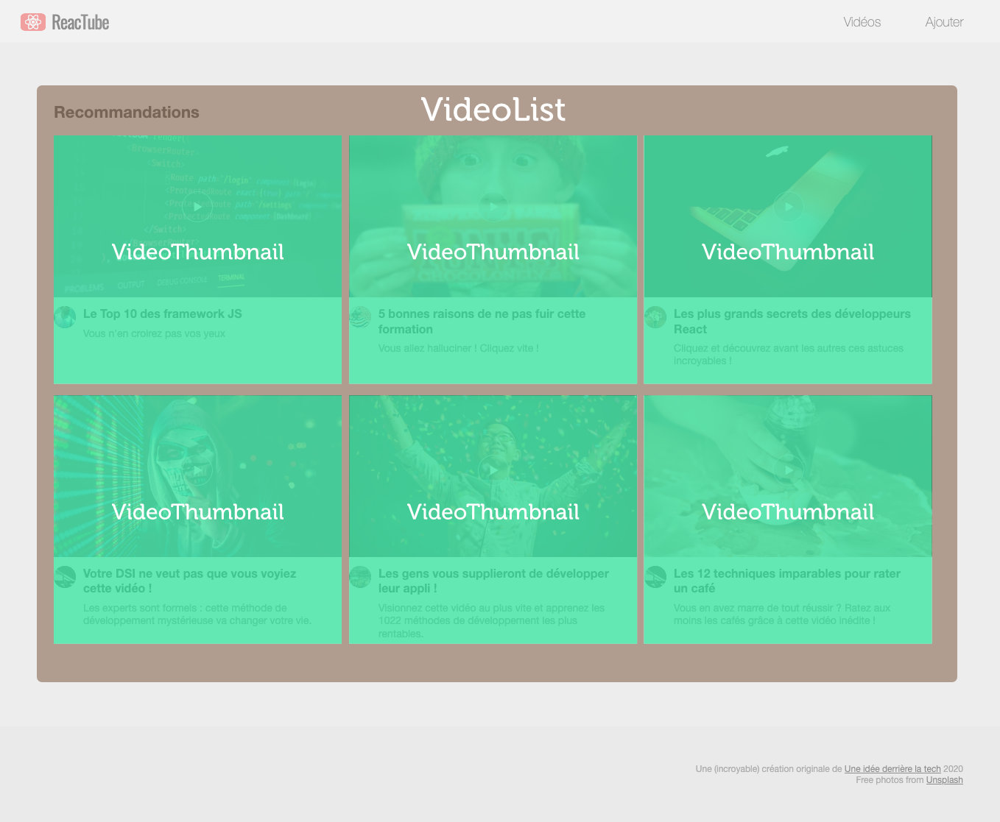

# B. Imbrication & props <!-- omit in toc -->

_**Dans cette partie du TP, nous allons modifier notre application pour mettre en oeuvre le principe d'imbrication et la technique des props.**_

Actuellement notre VideoList contient tout le JSX associé aux vignettes ce qui alourdi inutilement le composant (_dans l'absolu, le boulot de la VideoList c'est de rendre une liste de vignette, peu importe ce que les vignettes contiennent, ce n'est pas vraiment son affaire_).

On va donc **externaliser le code des vignettes dans des sous-composant, qu'on appellera `VideoThumbnail`**.

La `VideoList` contiendra autant d'instances de `VideoThumbnail` qu'il y a de vidéos dans le tableau `data.js`, ce qui nous donnera la structure suivante :

1. **Créez donc un composant `VideoThumbnail` dans un module `src/VideoThumbnail.jsx`.**

2. **Externalisez dans `VideoThumbnail` le JSX de chaque vignette de vidéo** (_tout le `<a href>...</a>`_)

	> **Astuce :** pensez à utiliser les React Devtools pour inspecter l'arborescence du virtual DOM, et détecter les éventuelles anomalies de structure

3. **Améliorez le code de VideoDetail en sortant tout ce qui concerne les commentaires dans un sous composant `CommentList`** (`src/CommentList.jsx`)

	Ce sous-composant sera lui-même composé :
	- d'un composant `CommentForm` contenant le formulaire d'ajout de commentaires,
	- et de plusieurs composants `CommentRenderer` pour le rendu de chaque commentaire (_une instance de `CommentRenderer` par commentaire dans la liste_).

## Étape suivante <!-- omit in toc -->
Une fois cette partie terminée, voyons comment utiliser conjointement React et l'API DOM : [C. Les refs](C-refs.md).