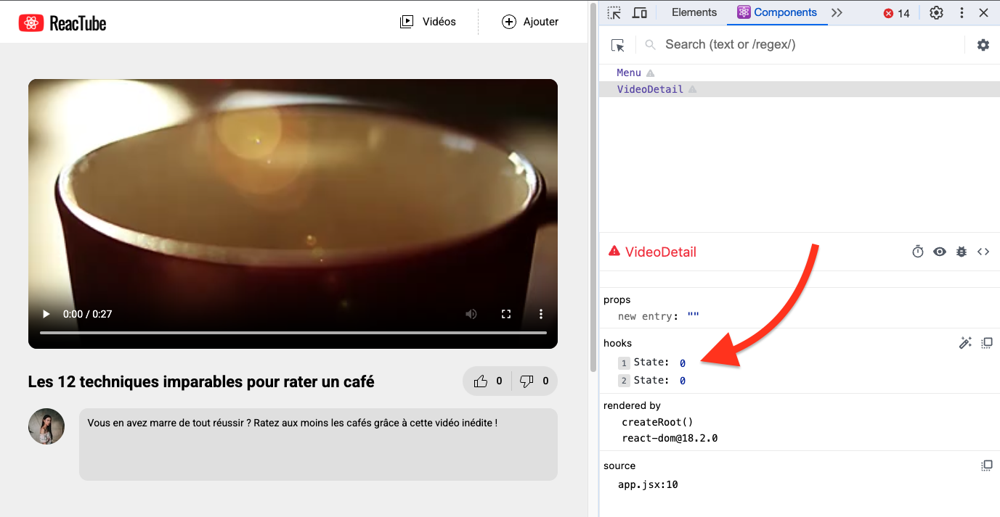
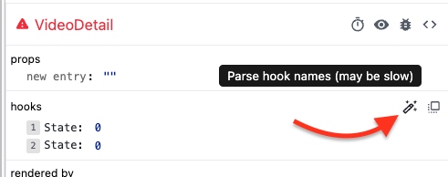
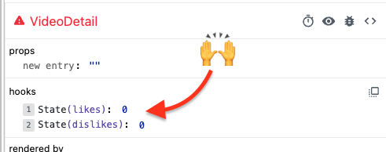

# B. useState  <!-- omit in toc -->

## Sommaire <!-- omit in toc -->
- [B.1. likes \& dislikes](#b1-likes--dislikes)
- [B.2. React Devtools](#b2-react-devtools)
- [B.3. Modifier le state](#b3-modifier-le-state)

## B.1. likes & dislikes

_**Pour commencer à nous exercer aux states, nous allons essayer d'ajouter des boutons "like" 👍 / "dislike" 👎 sur notre page `VideoDetail`.**_

1. **Ajoutez dans le JSX de `VideoDetail` le code html des boutons.** Juste après la balise `<h1>{title}</h1>` ajoutez une balise `<div class="likesContainer">` comme ceci
	```jsx
	<header>
		<h1>{title}</h1>
		<div className="likesContainer">
			<button className="like">0</button>
			<button className="dislike">0</button>
		</div>
	</header>
	```
	Vous devez obtenir ceci (_notez les 2 boutons à droite_) :

	

2. **Créez avec [`useState`](https://react.dev/reference/react/useState) 2 constantes `likes` et `dislikes`**, toutes les deux initialisées à 0.

	> <details><summary>ℹ️ <em>1 seul <code>useState</code> ou 2 <code>useState</code> ?</em></summary>
	>
	> _Comme il s'agit ici de 2 valeurs indépendantes, je vous recommande d'utiliser 2 `useState()` distincts : 1 pour `likes` et 1 autre pour `dislikes`._
	>
	> _Si les 2 valeurs étaient toujours mises à jour en même temps, alors on aurait pu avoir un seul `useState` avec à l'intérieur un objet contenant 2 propriétés `{ likes: 0, dislikes: 0 }`._
	> </details>

3. **Injectez ces valeurs dans le JSX du composant** pour qu'elles s'affichent dans les boutons like/dislike que l'on vient d'ajouter.

	Pour le moment, ne codez pas le click sur les boutons, on va s'en charger juste après avoir parlé **des devtools** !


## B.2. React Devtools

_**Maintenant que notre composant a un state, voyons un peu comment utiliser l'extension React Devtools que l'on a installée au précédent TP.**_

Dans la barre d'onglets des devtools de votre navigateur, ouvrez l'onglet `"Components"`, vous verrez en principe ceci :



Vous voyez le composant rendu dans la page, et son state : React Devtools détecte que le composant `VideoDetail` contient 2 states, tous les deux à `0`.

Pour savoir à quel state (`likes` ou `dislikes`) correspond quelle valeur, de base ce n'est pas évident car ils s'appellent tous les deux "`State`", seul leur index diffère.

Heureusement vous pouvez cliquer sur la petite icône à droite en forme de "baguette magique" pour afficher le nom des constantes associées :





Essayez de modifier la valeur d'un des deux states en cliquant sur l'un des `0` : vous voyez que l'affichage se met à jour automatiquement ? 🙌 C'est la magie du state (_re-render du composant à chaque modification_) qui opère !

> <details><summary>🚧 <em>A chaque fois qu'on modifie un state, la vidéo affichée change</em> 🤔</summary>
>
> _Effectivement, quand vous modifiez la valeur d'un des states, le composant `VideoDetail` se re-rend et la vidéo affichée, son titre et sa description sont mis à jour..._
>
> _Je vous propose de laisser de côté ce problème pour le moment et de se le réserver pour la toute fin s'il vous reste du temps, au pire on en reparlera à la correction !_
> </details>

## B.3. Modifier le state

**Maintenant que l'on a vu que la modification du state entraînait bien un refresh de la page, faites en sorte que lorsque l'utilisateur clique sur les deux boutons, les valeurs des states correspondants augmentent et que l'affichage se mette à jour !**

> <details><summary>ℹ️ <em>On fait comment déjà pour écouter des événements ?</em></summary>
>
> _On avait vu ça dans le chapitre précédent : la technique pour détecter le clic sur les boutons est de leur ajouter un attribut `onClick` et d'y injecter une fonction (nommée, anonyme ou arrow)._
>
> _Reprenez le pdf du cours si vous n'êtes plus au clair sur la syntaxe !_
> </details>

> 🚧 _À nouveau, les infos de la vidéo changent à chaque fois que le composant se re-rend, c'est normal, on verra ça plus tard._

## Étape suivante <!-- omit in toc -->
Si tout fonctionne, vous pouvez passer à l'étape suivante : [C. useEffect](C-useeffect.md)
