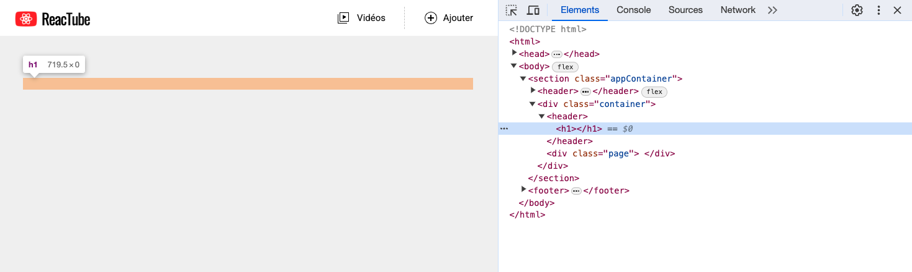
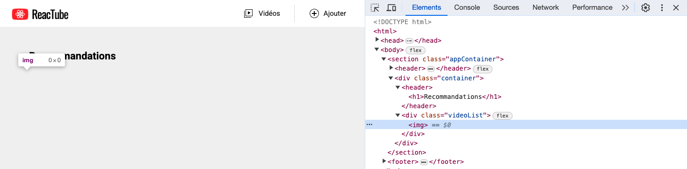

# C. La fonction renderElement <!-- omit in toc -->

_**Nous allons développer dans ce TP une fonction nommée `renderElement` qui va permettre de générer du code HTML en JS.**_

A chaque étape du TP vous allez perfectionner cette fonction pour la rendre capable de gérer des paramètres supplémentaires.

> _**NB :** Dans ce TP vous coderez dans un premier temps tout dans le fichier `src/main.ts` **sans passer par des fichiers (modules) séparés**._
>
> _Dans la suite du TP on organisera notre code plus proprement en le répartissant dans des modules différents._ \
> _Mais pour le moment on va simplifier les choses en remettant ça à plus tard (ne faites pas ça dans la vraie vie !)._

## Sommaire <!-- omit in toc -->
- [C.1. Rappels de syntaxe](#c1-rappels-de-syntaxe)
	- [C.1.1. Template strings](#c11-template-strings)
	- [C.1.2. Fonctions](#c12-fonctions)
- [C.2. La fonction renderElement](#c2-la-fonction-renderelement)

## C.1. Rappels de syntaxe

### C.1.1. Template strings

Comme vu dans le cours (*procurez-vous le support pdf !*), ES6 a introduit une nouvelle syntaxe pour les chaînes de caractères appelée [**"template strings"** (_mdn_)](https://developer.mozilla.org/en-US/docs/Web/JavaScript/Reference/Template_literals).

Cette nouvelle syntaxe permet notamment :
- de déclarer des chaînes de caractères **multi-lignes**
- **mais surtout d'injecter dedans des valeurs** sans avoir besoin de faire de la concaténation :
	```js
	const lawyer = 'Saul';
	const critic = 'better';
	console.log(`Better call ${lawyer} is ${critic} than Breaking Bad`);
	```

### C.1.2. Fonctions

ES6 a également introduit une nouvelle syntaxe pour l'écriture des fonctions : les **["arrow functions" (_ou "fonctions fléchées" en français_)](https://developer.mozilla.org/fr/docs/Web/JavaScript/Reference/Functions/Arrow_functions)**.

On a donc 3 façons différentes d'écrire des fonctions en JS/TS :

```js
function makeEpisode(hero:string) { // fonction nommée
	return `${hero} is dead !`;
}
// ou
const makeEpisode = function(hero:string) { // fonction anonyme
	return `${hero} is dead !`;
}
// ou
const makeEpisode = (hero:string) => { // arrow function ("lambda")
	return `${hero} is dead !`;
}
```

> <details><summary>ℹ️ <em>On avait pas dit qu'on pouvait simplifier encore plus l'écriture des arrow functions ?</em></summary>
>
> _Si si, quand le corps de la fonction ne contient qu'un `return`, on peut alors retirer les accolades et le mot clé `return` :_
> ```ts
> const makeEpisode = (hero:string) => `${hero} is dead !`; // return implicite
> ```
>
> _NB : Si on est dans une fonction dont le type est connu grâce à l'inférence de type (par exemple dans un callback d'event listener), et si la fonction ne prend qu'un seul paramètre, on peut en plus retirer les parenthèses autour du paramètre :_
>
> ```ts
> // En JS, comme on a pas de typage, on peut retirer les parenthèses autour de hero :
> const makeEpisode = hero => `${hero} is dead !`;
> // En TS, les parenthèses ne peuvent être enlevées que si on connait le type du paramètre
> // par exemple quand on est dans un callback d'event listener :
> myElement.addEventListener(
> 	'click',
> 	event => event.preventDefault(), // ici TS sait que event est de type Event (type inference)
> );
> ```
> </details>

Ces 3 déclarations ont exactement le même effet : elles créent en mémoire une référence qui a le nom `"makeEpisode"` et qui contient une valeur de type [`Function` (_mdn_)](https://developer.mozilla.org/en-US/docs/Web/JavaScript/Guide/Functions). \
Elles s'appellent donc toutes les 3 de la même manière :

```js
const newEpisode = makeEpisode('Benjen Stark');
```

## C.2. La fonction renderElement
1. **Effacez tout le contenu du fichier `src/main.ts`**.

2. **Dans le fichier `src/main.ts` créez une fonction `renderElement` qui s'utilise de la manière suivante :**
	```ts
	const title = renderElement( 'h1' );
	document.querySelector('.container > header')!.innerHTML = title;
	```
	+ la fonction **prend en paramètre une chaîne nommée `tagName`**
	+ elle **retourne une chaîne de caractères au format html**, qui représente une balise dont le type dépend du paramètre `tagName`.

		Par exemple si `tagName` vaut `'div'` alors `renderElement()` retournera la chaîne de caractères :
		```js
		'<div></div>'
		```
		Dans notre exemple plus haut, `tagName` vaut `'h1'`, `renderElement` retourne donc :
		```js
		'<h1></h1>'
		```
	> <details><summary>💡 <em><strong>pro tip :</strong> pour cet exercice utilisez les template strings...</em></summary>
	>
	> _Cela vous permettra d'injecter facilement des valeurs dans votre chaîne et en plus de passer à la ligne dans la chaîne de caractères pour rendre votre code plus lisible._
	> </details>

	<br/>

	> <details><summary>ℹ️ <em>Ça fait quoi la ligne <code>"document.querySelector(...)..."</code> ?</em></summary>
	>
	> _Cette instruction permet d'injecter dans la page HTML la chaîne de caractères contenue dans `title`._
	>
	> _`document.querySelector('.container > header')` ([mdn](https://developer.mozilla.org/fr/docs/Web/API/Document/querySelector)) permet de récupérer une référence vers la balise `<header>` contenue dans la balise de classe CSS `"container"`._ \
	> _Si vous regardez dans le fichier `index.html` vous allez y trouver en effet une balise `<div class="container">`, qui contient elle-même une sous-balise `<header>` (juste au-dessus de `<div class="videoList">`) :_
	> ```html
	> <div class="container">
	> 	<header></header> <!-- 👈 c'est cette balise qu'on cible -->
	> 	<div class="videoList">
	> 	</div>
	> </div>
	> ```
	>
	> _La propriété [`innerHTML` (mdn)](https://developer.mozilla.org/fr/docs/Web/API/Element/innerHTML) permet d'écrire dans la balise la valeur passée après le `=` (ici la chaîne contenue dans `title`)._
	> </details>

	> <details><summary>ℹ️ <em>C'est quoi ce "<code>!</code>" devant "<code>.innerHTML</code>" ?</em></summary>
	>
	> _Il s'agit d'un opérateur qui n'existe qu'en TypeScript : le ["Non Null Assertion Operator" (doc)](https://www.typescriptlang.org/docs/handbook/2/everyday-types.html#non-null-assertion-operator-postfix-)._
	>
	> _Il permet de dire à TypeScript qu'on est **certains que la valeur qui se trouve à gauche n'est pas nulle**._
	>
	> _C'est important parce que sinon TypeScript râle (à juste titre) sur le fait que ce que retourne `querySelector(...)` peut être `null` (par exemple si il ne trouve pas la balise dans la page HTML) et qu'on ne peut pas appeler une propriété (`.innerHTML`) sur quelque chose de `null`._ \
	> _Dans notre situation on est quasi certains que cette balise existera toujours, on peut donc "forcer la main" à TS pour lui dire de considérer que cette valeur ne sera jamais nulle._
	>
	> _Dans la vraie vie on aurait sans doute plutôt rajouté un test pour vérifier que la valeur retournée par `querySelector` n'est pas nulle avant de manipuler le DOM :_
	> ```ts
	> const headerElement = document.querySelector('.container > header');
	> if (headerElement) {
	>      headerElement.innerHTML = title;
	> }
	> ```
	> </details>

	**Vérifiez que votre fonction "fonctionne" correctement en inspectant le code généré par votre application avec l'Inspecteur d'éléments des devtools du navigateur.**

	> _**NB :** On passe par l'inspecteur d'éléments car visuellement à l'écran, c'est difficile de contrôler le rendu : rien ne s'affiche car notre balise `<h1>` est vide !_

	


3. **Ajoutez un second paramètre à la fonction `renderElement`, nommé `children`** (_string également_). Modifiez le code de la fonction de manière à ce que le code suivant :
    ```ts
	const title = renderElement( 'h1', 'Recommandations' );
	document.querySelector('.container > header')!.innerHTML = title;
	```
	Injecte dans la page le code suivant :
	```js
	'<h1>Recommandations</h1>'
	```

	Contrôlez que le rendu est bien conforme à la capture suivante :

	

4. **Modifiez le fonctionnement de la fonction pour prendre en compte le cas où `children` est vide** (`null` ou `undefined`). Par exemple si j'appelle `renderElement` comme ceci :
	```js
	const img = renderElement( 'img' );
	```
	`renderElement` doit retourner la chaîne `''` (_une balise "auto fermante", c'est-à-dire sans enfants_) et pas `'</img>'` (_car ce n'est pas un code HTML valide selon la spec du W3C_).

	> <details><summary>ℹ️ <em>Comment on fait pour dire à TypeScript qu'un paramètre de fonction est facultatif ?</em></summary>
	>
	> _La réponse dans la documentation : https://www.typescriptlang.org/docs/handbook/2/functions.html#optional-parameters_ 🙂
	> </details>

	**Testez votre fonction en ajoutant dans le `main.ts`** le code suivant (_conservez le code de title, on en aura encore besoin_) :
	```js
	const img = renderElement( 'img' );
	document.querySelector( '.videoList' )!.innerHTML = img;
	```
	Vérifiez dans **l'inspecteur d'éléments** que votre image est bien ajoutée dans `videoList` :

	> _**NB :** Comme tout à l'heure avec le `h1`, on passe par l'inspecteur d'éléments car visuellement à l'écran, c'est difficile de contrôler le rendu : aucune image ne s'affiche car on n'a pas précisé ni de source ni de taille à l'image !_

	> <details><summary>🚧 <em>Les devtools affichent toujours "<code>&lt;img&gt;</code>" et pas "<code>&lt;img /&gt;</code>"</em> ☹️</summary>
	>
	> _Selon votre navigateur il est en effet possible que l'inspecteur d'éléments n'affiche que `` et pas ``. C'est une simplification faite par les devtools, mais ça ne veut pas dire que votre code ne fonctionne pas. Testez donc votre code avec `console.log(img)`, là vous saurez avec certitude si votre méthode retourne bien ``._
	> </details>

	

5. **Ajoutez un nouveau paramètre `attribute` en 2e position de la fonction `renderElement` :**

	La signature de la fonction sera désormais :
	```js
	renderElement( tagName, attribute, children ) {
	```

	**Modifiez donc la fonction `renderElement()` pour prendre en compte ce nouveau paramètre `attribute`**. On considère que ce paramètre aura toujours la forme d'un objet littéral avec deux propriétés : `name` et `value`. C'est-à-dire que si le paramètre `attribute` a été fourni comme ceci :

	```js
	const img = renderElement( 'img', {name:'src', value:'https://unsplash.uidlt.fr/wOHH-NUTvVc/600x340'} );
	```

	alors `img` doit contenir la chaîne suivante :
	```html
	
	```

	> <details><summary>ℹ️ <em>Comment typer des objets littéraux ?</em></summary>
	>
	> _Ça se fait en utilisant une notation sous accolades et en typant chaque propriété de l'objet : https://www.typescriptlang.org/docs/handbook/2/everyday-types.html#object-types_
	>
	> _**Par exemple**, si on a une variable qui doit contenir un objet littéral avec 2 propriétés `prenom` (chaîne) et `age` (nombre) on pourra la définir comme ceci :_
	> ```ts
	> let personnage: { prenom: string, age: number };
	> ```
	>
	> _On peut aussi définir des [alias de type (doc)](https://www.typescriptlang.org/docs/handbook/2/everyday-types.html#type-aliases) pour séparer la définition du type de l'endroit où on l'utilise :_
	> ```ts
	> type Humain = {
	>     prenom: string,
	>     age: number,
	> };
	> let personnage: Humain;
	> ```
	> </details>

	> <details><summary>🚧 <em>Quand je modifie l'ordre des paramètres, la création de <code>title</code> plante</em> 😭 </summary>
	>
	> _Oui c'est normal, pour `title` on passait jusque là seulement 2 paramètres à la fonction `renderElement`, le `children` se retrouve donc à la place du `attribute`._
	>
	> _Pour régler le problème, vous avez le droit de modifier la création de `title` en passant `null` au paramètre `attribute` :_
	> ```ts
	> const title = renderElement( 'h1', null, 'Recommandations' );
	> ```
	>
	> _Attention à bien prendre ça en compte dans le typage, par exemple en utilisant les [Unions de types (doc)](https://www.typescriptlang.org/docs/handbook/2/everyday-types.html#union-types)_
	> </details>

	Testez ce nouveau code, le rendu devra cette fois être :

	

## Étape suivante <!-- omit in toc -->
Maintenant que notre fonction `renderElement` est bien avancée, il est l'heure de répartir notre code dans différents fichiers à l'aide des modules ! RDV donc dans la partie suivante : [D. Modules](./D-modules.md)