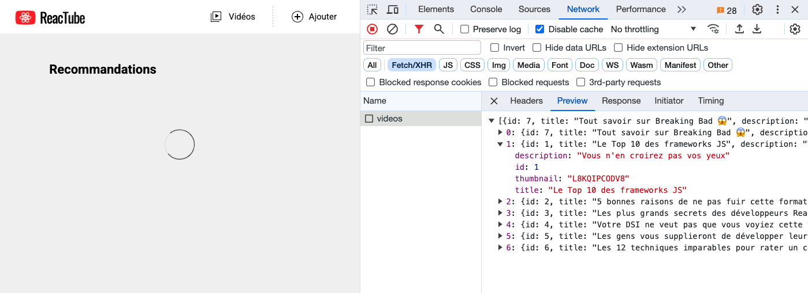

# C. useEffect  <!-- omit in toc -->

_**Pour s'exercer à `useEffect`, je vous propose de travailler sur le composant `VideoList` : on va essayer de "simuler" un délai de chargement avant d'afficher la liste des vignettes.** Ça nous permettra d'utiliser useEffect et en même temps de préparer la suite de la formation, notamment pour le moment où l'on connectera notre appli à l'API REST_ 👍

## Sommaire <!-- omit in toc -->
- [C.1. Ajouter un state](#c1-ajouter-un-state)
- [C.2. Utiliser useEffect](#c2-utiliser-useeffect)

## C.1. Ajouter un state

1. Au lieu d'utiliser dans notre JSX la valeur du tableau `data` défini dans le fichier `src/data.js`, créez plutôt un state local nommé `videos` et initialisé avec un tableau vide (`[]`).
2. Utilisez ce state `videos` dans le .map qui génère les vignettes.

	Rechargez la page, normalement les vignettes ont disparu, normal.

	

## C.2. Utiliser useEffect

2. **Ajoutez au composant `VideoList` un appel à `useEffect` qui s'exécute uniquement après le premier render** (mettez-y juste un console.log pour le moment).

3. **Dans ce useEffect, utilisez la fonction [`setTimeout()`](https://developer.mozilla.org/fr/docs/Web/API/WindowOrWorkerGlobalScope/setTimeout) pour injecter dans le state, la liste des vidéos issues de `data` au bout de 2 secondes.**

	Rechargez la page, les vidéos doivent apparaître après ce délai ! Youpi !

## Étape suivante <!-- omit in toc -->
Si tout fonctionne, et qu'il vous reste du temps vous pouvez passer à des exercices supplémentaires dans la partie : [D. Pour aller plus loin](D-plus-loin.md)

