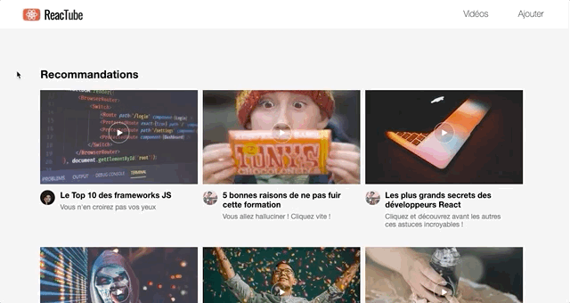

# D. Navigation maison <!-- omit in toc -->

_**Pour terminer ce TP, nous allons tenter de mettre en place un système de navigation maison !**_

_**L'idée est d'afficher par défaut la `VideoList` mais de permettre à l'utilisateur, s'il clique sur une vignette, de consulter le `VideoDetail` associé :**_



## Sommaire <!-- omit in toc -->
- [D.1. Cahier des charges](#d1-cahier-des-charges)
- [D.2. Indices](#d2-indices)

## D.1. Cahier des charges

1. **Dans le fichier `app.tsx`, au lieu de rendre le composant `VideoList` ou `VideoDetail`, instanciez un nouveau composant nommé `Navigator`.**
2. **Ce composant `Navigator` affichera par défaut la `VideoList`**
3. **Au clic sur un des `VideoThumbnail`, la `VideoList` doit demander au `Navigator` d'afficher le `VideoDetail` et lui passer l'id de la vidéo à afficher.**
4. **Le `VideoDetail` devra récupérer dans `data.ts` la vidéo correspondant à l'id demandé** (_attention, on considère que les ids ne sont pas forcément dans l'ordre : utilisez plutôt la méthode [`array.find()`](https://developer.mozilla.org/fr/docs/Web/JavaScript/Reference/Objets_globaux/Array/find)_).
5. **Un bouton dans `VideoDetail` doit permettre de retourner à la liste** (_sans recharger complètement la page, sinon c'est de la triche !_).

	Pour un affichage "harmonieux" avec les CSS, je vous recommande ce markup HTML à placer juste avant la balise `<video>` :
	```html
	<button class="backButton">
		&lt; Retour
	</button>
	```


## D.2. Indices
Si vraiment vous voulez des indices, alors il va falloir scroller un peu !
<br>
<br>
<br>
<br>
<br>
<br>
<br>
<br>
<br>
<br>
<br>
<br>
<br>
<br>
<br>
<br>
<br>
<br>
<br>
<br>
<br>
<br>
<br>
<br>
<br>
<br>
<br>
<br>
<br>
<br>
<br>
<br>
<br>
...Vous êtes sûr d'avoir besoin d'aide ?
<br>
<br>
<br>
<br>
<br>
<br>
<br>
<br>
<br>
<br>
<br>
<br>
<br>
<br>
<br>
<br>
<br>
<br>
<br>
<br>
<br>
<br>
<br>
<br>
<br>
<br>
<br>
<br>
<br>
<br>
<br>OK, alors scrollez encore !
<br>
<br>
<br>
<br>
<br>
<br>
<br>
<br>
<br>
<br>
<br>
<br>
<br>
<br>
<br>
<br>
<br>
<br>
<br>
<br>
<br>
<br>
<br>
<br>
<br>
<br>
<br>
<br>
<br>
<br>
<br>
<br>
<br>
<br>
<br>
<br>
<br>
<br>
<br>
<br>
<br>
<br>
<br>
<br>
<br>
<br>
<br>
<br>
<br>
<br>
<br>

> <details><summary>💡 <em>Allez, vous voulez vraiment des indices ? OK, ok cliquez ici</em></summary>
>
> 1. _Il faudra un **`state`** dans le `Navigator` qui indique la page en cours (par exemple sous la forme d'un identifiant de type string comme 'list' ou 'detail')_
>
> 2. _C'est **en fonction de ce state** que `Navigator` choisira d'afficher soit la `VideoList` soit `VideoDetail`_
> 3. _**Il faudra aussi trouver un moyen de dire au `Navigator` que l'utilisateur a cliqué sur une vignette de la `VideoList`** pour qu'il change son state (ce qui permettra de déclencher un re-render de `Navigator` et donc afficher le `VideoDetail`)._
>
>     _Pour ça, sachez que quand on passe des **`props`** à un composant enfant, même si jusque là on a toujours passé des valeurs simples (chaînes, nombres, objets), on a aussi le droit de **passer des références vers des fonctions. On peut par exemple passer en prop du composant enfant une fonction définie dans le composant parent** (en JS/TS les fonctions sont un type de valeur comme un autre !)_ 🤔 !
>
>     _Une fois que le composant enfant a la fonction de son parent dans ses `props` il peut alors l'appeler quand il veut, et même lui envoyer des paramètres !_
>
>     _Ce pattern permet de faire remonter de l'information du composant enfant vers son parent (alors que jusque là on avait vu que les `props` servaient surtout à faire descendre des infos du parent vers l'enfant)_ 🤯
>
> _Si après ça vous avez encore besoin d'aide, interrogez-moi !_ 😄
>
> </details>
