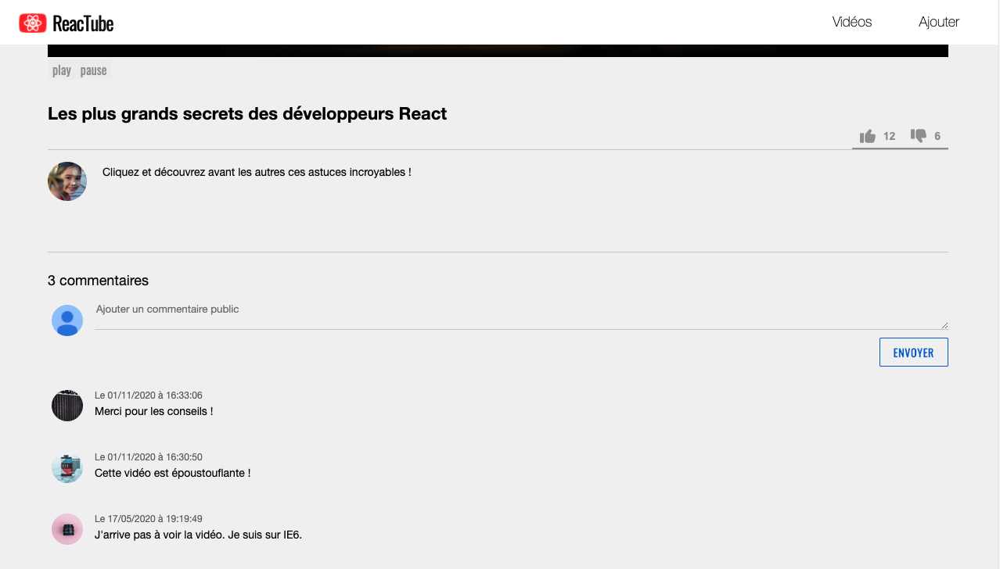

# D. Perfectionnement <!-- omit in toc -->

_**Notre application commence à prendre forme : on est capables de lire et d'écrire dans la base de données, c'est déjà pas mal !**_

_**En revanche il reste un certain nombre de choses qui sont encore en dur dans le code et que l'on doit dynamiser. <br>C'est parti !**_

## Sommaire <!-- omit in toc -->
- [D.1. VideoDetail](#d1-videodetail)
- [D.2. Redirection VideoForm -> VideoDetail](#d2-redirection-videoform-videodetail)
- [D.3. API likes/dislikes](#d3-api-likesdislikes)
- [D.4. Les commentaires](#d4-les-commentaires)


## D.1. VideoDetail

**En vous inspirant de ce que vous avez fait à la partie [B. AJAX](B-ajax.md) dans la `VideoList`, connectez le composant `VideoDetail` au webservice http://localhost:8080/api/videos/:id** (_ou `:id` correspond à l'id de la vidéo à afficher_)

> _**NB :** Pour que ce soit plus simple à tester, je vous conseille de remettre la page `VideoList` comme page par défaut dans le `Navigator`._

> _**NB2 :** une fois le `VideoDetail` connecté à l'API, vous pouvez supprimer le fichier `src/data.js` qui n'est plus utile._

## D.2. Redirection VideoForm -> VideoDetail
**Maintenant que le `VideoDetail` est dynamisé, profitons en pour modifier le comportement du `VideoForm`** : une fois l'enregistrement d'une nouvelle vidéo terminé, au lieu de rediriger l'utilisateur vers la page liste, **redirigez le plutôt vers la page détail** de la vidéo qu'il vient d'enregistrer !

> _**Indice :** inspectez bien le corps de la réponse à votre requête POST...)_

## D.3. API likes/dislikes
_**Connectons maintenant les boutons like/dislike de la page `VideoDetail` à l'API.**_

1. **Dans la page `VideoDetail`, faites en sorte que :**
	- le clic sur le bouton **"like"** lance un **POST vers http://localhost:8080/api/videos/:id/likes**
	- et que le click sur le bouton **"dislike"** lance un **POST http://localhost:8080/api/videos/:id/dislikes**

		(_où **`:id`** est l'id de la vidéo actuellement affichée dans `VideoDetail`_)
3. **Une fois le POST terminé, mettez à jour le nombre de likes affichés dans la page** (_à partir des données en bdd, quelques fois qu'un autre utilisateur aurait lui aussi entre temps cliqué sur les boutons_ 😉 ).

## D.4. Les commentaires

_**Dans ce dernier exercice, je vous propose de mettre en place un système de commentaires dans la page de détail.**_



Plusieurs contraintes :
- le formulaire d'ajout de commentaire doit être un formulaire **contrôlé**
- l'API pour les commentaires est **déjà fournie** :
	- **GET http://localhost:8080/api/videos/1/comments** retourne les commentaires de la vidéo d'id 1
	- **POST http://localhost:8080/api/videos/1/comments** ajoute un nouveau commentaire.

		Le body de la requête sera de la forme :
		```json
		{
			"content": "Le message saisi par l'utilisateur"
		}
		```
- Une fois un commentaire ajouté, la **liste des commentaires doit se rafraîchir**
- le commentaire le plus récent est en haut
- pour chaque commentaire on affiche son contenu et sa date de publication au format `"Le 06/07/2020 à 13:37:42"`
- pendant le chargement l'utilisateur ne doit pas pouvoir saisir de texte ou re-cliquer sur le bouton submit

Voici une proposition de code HTML qui devrait rendre à peu près bien dans la page :
```html
<aside class="commentList">
	<h2>X commentaires</h2>
	<form class="commentForm">
		<textarea
			name="content"
			rows="2"
			placeholder="Ajouter un commentaire public"
		></textarea>
		<button type="submit">Envoyer</button>
	</form>
	<article class="commentRenderer">
		<time datetime="2020-06-08 22:40:41">Le 08/06/2020 à 22:40:41</time>
		<p>Génial ! Vive React</p>
	</article>
</aside>
```