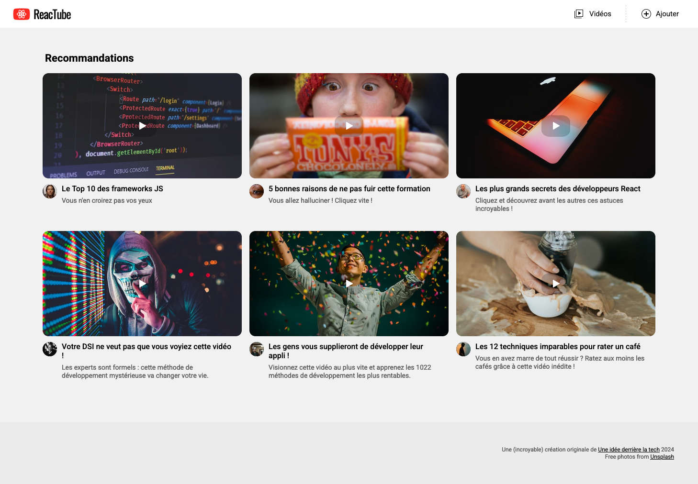

# D. JSX : Les boucles <!-- omit in toc -->

_**Maintenant que l'on est capables d'afficher des composants, d'injecter des valeurs JS à l'intérieur du JSX, voyons si vous êtes à même d'en créer un autre, qui nécessite une boucle.**_

## Sommaire <!-- omit in toc -->
- [D.1. Création du composant](#d1-création-du-composant)
- [D.2. Récupération des données](#d2-récupération-des-données)

## D.1. Création du composant

1. **Créez un nouveau composant nommé `VideoList` dans un module `src/VideoList.jsx`.**

	Pour le moment faites en sorte qu'il retourne juste le code suivant :

	```html
		<div class="container">
			<header>
				<h1>Recommandations</h1>
			</header>
			<div class="videoList"></div>
		</div>
	```

2. **Modifiez le `app.jsx` pour qu'il rende le composant `VideoList` au lieu du `VideoDetail`.**


## D.2. Récupération des données
1. **Commencez par importer la constante `data`** définie dans le module `src/data.js`.
2. **Utilisez la pour retourner à l'intérieur de la `<div class="videoList">` autant de balises de ce type que de cellules dans `data`** :
	```html
	<a href="uploads/video1.mp4">
		
		<section class="infos">
			<h4>Le Top 10 des framework JS</h4>
			<p>Vous n'en croirez pas vos yeux</p>
		</section>
	</a>
	```

Le résultat doit être le suivant (_ça ressemble à ce qu'on avait fait au TP1 hein ?_) :




## Étape suivante <!-- omit in toc -->
Une fois cette partie terminée, passons à quelques exercices avancés dans la partie [E. Pour aller plus loin](E-optimisations.md).