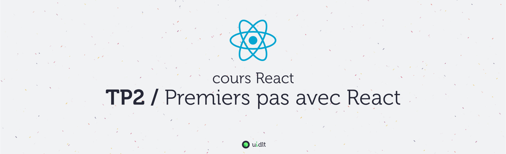

## Objectifs
- Connecter une appli React à une API REST
- Intégrer des formulaires non contrôlés
- Intégrer des formulaires contrôlés

## Sommaire
Pour plus de clarté, les instructions du TP se trouvent dans des fichiers distincts (un fichier par sujet), procédez dans l'ordre sinon, ça fonctionnera beaucoup moins bien ! :

1. [A. Préparatifs](A-preparatifs.md)
2. [B. AJAX](B-ajax.md)
3. [C. VideoForm](C-VideoForm.md)
4. [D. Perfectionnement](D-perfectionnement.md).
